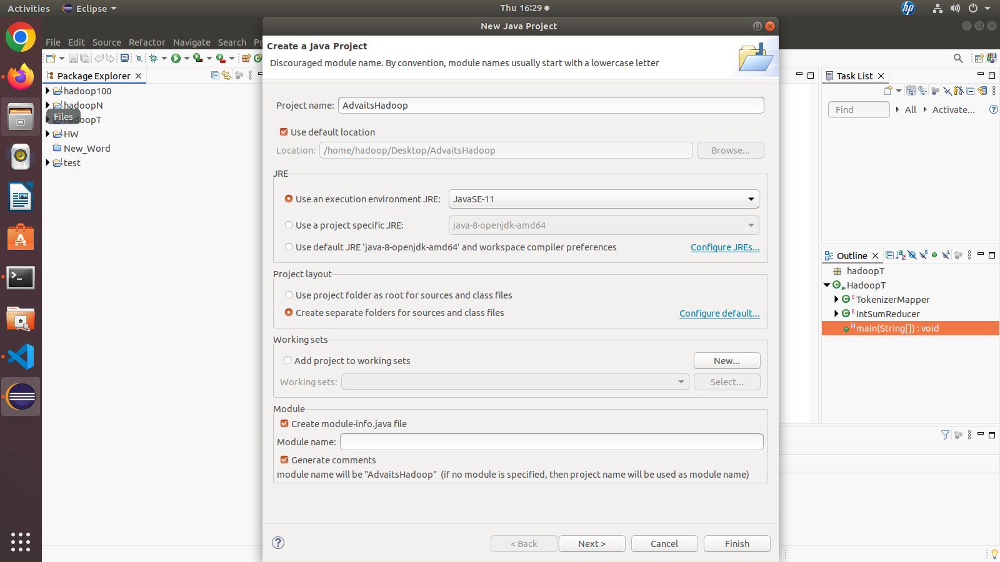

# Step 1: Run JVM Process Status (jps)
```bash
hadoop@pict-OptiPlex-5070:~$ jps
3890 Jps
```
---
# Step 2: Start all Apache Hadoop Daemons
```bash
hadoop@pict-OptiPlex-5070:~$ start-all.sh

WARNING: Attempting to start all Apache Hadoop daemons as hadoop in 10 seconds.
WARNING: This is not a recommended production deployment configuration.
WARNING: Use CTRL-C to abort.
Starting namenodes on [localhost]
Starting datanodes
Starting secondary namenodes [pict-OptiPlex-5070]
Starting resourcemanager
Starting nodemanagers
```
---
# Step 3: Run JPS to verify
```bash
hadoop@pict-OptiPlex-5070:~$ jps

4128 NameNode
6082 Jps
4978 ResourceManager
4694 SecondaryNameNode
4393 DataNode
5230 NodeManager
```
---
# Step 4:
Goto http://localhost:9870 (namenode)

Goto `Utilities` -> Browse File System (open in new tab)  

Goto `Live Nodes` -> click http address of datanode (open in new tab)  

Goto http://localhost:8088/cluster (all jobs)  

---
# Step 5:

```bash
hadoop@pict-OptiPlex-5070:~$ hadoop fs -mkdir /advait
hadoop@pict-OptiPlex-5070:~$ hadoop fs -mkdir /advait/input
```

---
# Step 6: Create new Eclipse Java Project



> Make sure to select Java SE 11!


**Step 6.1**  Delete moduleinfo folder

**Step 6.2**  Create a package in src folder -> `hadoop`

**Step 6.3**  Create a class in `/src/hadoop` called `WordCount`

**Step 6.4**  Right Click on Project Name -> Select Build Path -> Configure Build Path -> Classpath then click `Add External Jar`

**Step 6.5**  
Goto `/home/hadoop/hadoop-3.3.5/share/hadoop/common/` and add all jars from that folder

**Step 6.6**  
Goto `/home/hadoop/hadoop-3.3.5/share/hadoop/mapreduce` and add all jars from that folder

Paste this code

```java
package hadoop;

import java.io.IOException;
import java.util.StringTokenizer;

import org.apache.hadoop.conf.Configuration;
import org.apache.hadoop.fs.Path;
import org.apache.hadoop.io.IntWritable;
import org.apache.hadoop.io.Text;
import org.apache.hadoop.mapreduce.Job;
import org.apache.hadoop.mapreduce.Mapper;
import org.apache.hadoop.mapreduce.Reducer;
import org.apache.hadoop.mapreduce.Reducer.Context;
import org.apache.hadoop.mapreduce.lib.input.FileInputFormat;
import org.apache.hadoop.mapreduce.lib.output.FileOutputFormat;


public class WordCount {


	 public static class TokenizerMapper

	      extends Mapper<Object, Text, Text, IntWritable>{


	   private final static IntWritable one = new IntWritable(1);

	   private Text word = new Text();


	   public void map(Object key, Text value, Context context

	                   ) throws IOException, InterruptedException {

	     StringTokenizer itr = new StringTokenizer(value.toString());

	     while (itr.hasMoreTokens()) {

	       word.set(itr.nextToken());

	       context.write(word, one);

	     }

	   }

	 }


	 public static class IntSumReducer

	      extends Reducer<Text,IntWritable,Text,IntWritable> {

	   private IntWritable result = new IntWritable();


	   public void reduce(Text key, Iterable<IntWritable> values,

	                      Context context

	                      ) throws IOException, InterruptedException {

	     int sum = 0;

	     for (IntWritable val : values) {

	       sum += val.get();

	     }

	     result.set(sum);

	     context.write(key, result);

	   }

	 }


	 public static void main(String[] args) throws Exception {

	   Configuration conf = new Configuration();

	   Job job = Job.getInstance(conf, "word count");

	   job.setJarByClass(WordCount.class);

	   job.setMapperClass(TokenizerMapper.class);

	   job.setCombinerClass(IntSumReducer.class);

	   job.setReducerClass(IntSumReducer.class);

	   job.setOutputKeyClass(Text.class);

	   job.setOutputValueClass(IntWritable.class);

	   FileInputFormat.addInputPath(job, new Path(args[0]));

	   FileOutputFormat.setOutputPath(job, new Path(args[1]));

	   System.exit(job.waitForCompletion(true) ? 0 : 1);

	 }

}
```
---
# Step 7: Save as Jar   

Right click on package `hadoop` and export as `jar` file. Save the jar file as `wordcount.jar`

---
# Step 8: Create and Upload `input.txt`
Create a `input.txt` file and add some lines.  
Store the file in desktop where you have stored your jar file.  
Then upload this input.txt file in the directory u made at the start  

```bash
hadoop fs -put input.txt /tirthraj/input
```
---
# Step 10 : Run the Map Reduce Job
This is how to run the map reduce job
`hadoop jar <jar-file-name> <package-name>.<class-name> <hfds-input-folder> <hdfs-output-folder>`  

Example
```bash
hadoop jar wordcount.jar hadoop.WordCount /tirthraj/input /tirthraj/output


2025-04-24 16:57:23,426 INFO client.DefaultNoHARMFailoverProxyProvider: Connecting to ResourceManager at /127.0.0.1:8032
2025-04-24 16:57:23,740 WARN mapreduce.JobResourceUploader: Hadoop command-line option parsing not performed. Implement the Tool interface and execute your application with ToolRunner to remedy this.
2025-04-24 16:57:23,773 INFO mapreduce.JobResourceUploader: Disabling Erasure Coding for path: /tmp/hadoop-yarn/staging/hadoop/.staging/job_1745491633223_0001
2025-04-24 16:57:23,992 INFO input.FileInputFormat: Total input files to process : 1
2025-04-24 16:57:24,206 INFO mapreduce.JobSubmitter: number of splits:1
2025-04-24 16:57:24,355 INFO mapreduce.JobSubmitter: Submitting tokens for job: job_1745491633223_0001
2025-04-24 16:57:24,355 INFO mapreduce.JobSubmitter: Executing with tokens: []
2025-04-24 16:57:24,474 INFO conf.Configuration: resource-types.xml not found
2025-04-24 16:57:24,474 INFO resource.ResourceUtils: Unable to find 'resource-types.xml'.
2025-04-24 16:57:24,635 INFO impl.YarnClientImpl: Submitted application application_1745491633223_0001
2025-04-24 16:57:24,654 INFO mapreduce.Job: The url to track the job: http://pict-OptiPlex-5070:8088/proxy/application_1745491633223_0001/
2025-04-24 16:57:24,655 INFO mapreduce.Job: Running job: job_1745491633223_0001
2025-04-24 16:57:30,739 INFO mapreduce.Job: Job job_1745491633223_0001 running in uber mode : false
2025-04-24 16:57:30,741 INFO mapreduce.Job:  map 0% reduce 0%
2025-04-24 16:57:34,799 INFO mapreduce.Job:  map 100% reduce 0%
2025-04-24 16:57:38,825 INFO mapreduce.Job:  map 100% reduce 100%
2025-04-24 16:57:38,851 INFO mapreduce.Job: Job job_1745491633223_0001 completed successfully
2025-04-24 16:57:38,950 INFO mapreduce.Job: Counters: 54
```

---

# DONE!!!
Go to the file and see the output from the webUI (`Utilites` > `Browse File System` > `tirthraj` > `output`)
    
OR 
  
Run this command  
```bash
hadoop@pict-OptiPlex-5070:~/Desktop$ hadoop fs -cat /tirthraj/output/part-r-00000


Hello	1
I	1
Tirthraj	2
am	1
best	1
coding.	1
god	1
in	1
is	2
my	1
name	1
of	1
the	2
world.	1

```
